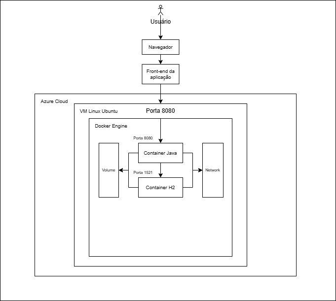

# 🐾 PetFlow API — DevOps & Cloud Computing

[](https://adoptium.net/)
[](https://spring.io/projects/spring-boot)
[](https://www.h2database.com/)
[](https://www.docker.com/)
[](https://azure.microsoft.com/)
[](https://swagger.io/)

---

## 📋 Sumário

- [Sobre o Projeto](#-sobre-o-projeto)
- [Equipe](#-equipe)
- [Tecnologias Utilizadas](#️-tecnologias-utilizadas)
- [Arquitetura Macro na Nuvem](#️-arquitetura-macro-na-nuvem)
- [Visão de Domínio](#-visão-de-domínio)
- [Instalação da Solução (How To)](#-instalação-da-solução-how-to)
- [Remoção dos Recursos na Nuvem](#️-remoção-dos-recursos-na-nuvem)
- [Demonstração em Vídeo](#-demonstração-em-vídeo)
- [Observações Finais](#-observações-finais)

---

## 📌 Sobre o Projeto

O **PetFlow** é uma API REST desenvolvida em Java com Spring Boot para gerenciamento de saúde preventiva pet. A solução gamifica o cuidado com os animais: eventos de saúde concluídos geram pontos para o tutor, que podem ser trocados por cupons de desconto em clínicas veterinárias parceiras.

Nesta entrega de **DevOps & Cloud Computing**, a aplicação foi conteinerizada com Docker e implantada em uma Máquina Virtual Linux na Azure, com banco de dados H2 persistido em volume nomeado e acesso externo via porta 8080.

---

## 👥 Equipe

| Nome | RM |
|---|---:|
| Lucas Grillo Alcântara | 561413 |
| Pietro Ferreira Gomes Abrahamian | 561469 |
| Pedro Peres Benitez | 561792 |
| Lucca Ramos Mussumecci | 562027 |

**Turma:** 2TDSPX — FIAP

---

## 🛠️ Tecnologias Utilizadas

| Tecnologia | Uso |
|---|---|
| Java 21 | Linguagem principal |
| Spring Boot | Framework da aplicação |
| Spring Data JPA | Persistência e ORM |
| Spring Validation | Validação de dados |
| Spring Cache | Cache em memória |
| H2 Database | Banco de dados conteinerizado |
| Lombok | Redução de boilerplate |
| Swagger / OpenAPI | Documentação automática da API |
| Maven | Gerenciamento de dependências e build |
| Docker / Docker Compose | Conteinerização da aplicação e banco |
| Azure CLI | Provisionamento de infraestrutura na nuvem |
| Ubuntu 24.04 LTS (Azure VM) | Sistema operacional da VM |

---

## 🏗️ Arquitetura Macro na Nuvem

> 📸 **Diagrama de Arquitetura**
>
>
> 

A solução é composta pelos seguintes elementos na nuvem:

```
[Usuário / Tester]
       │
       │  HTTP :8080
       ▼
[Azure VM — Ubuntu 24.04 LTS]
  ├── Container: petflow-api  (porta 8080)
  │       └── Spring Boot + Java 21
  │               └── conecta via TCP ao banco
  └── Container: h2db  (porta 1521)
          └── H2 Database Server
                  └── Volume nomeado: h2-data
                          └── /opt/h2-data (persistência física)

[Rede interna Docker: petflow-network]
```

**Fluxo resumido:**
1. O usuário acessa a API externamente pelo IP público da VM na porta `8080`.
2. O container `petflow-api` processa a requisição e se comunica com o container `h2db` via rede Docker interna (`petflow-network`) na porta `1521`.
3. O banco H2 persiste os dados no volume nomeado `h2-data`, garantindo que os dados sobrevivam a reinicializações dos containers.

---

## 🧠 Visão de Domínio

| Entidade | Descrição |
|---|---|
| **Tutores** | Responsáveis pelos pets cadastrados no sistema |
| **Pets** | Animais vinculados a um tutor |
| **Clínicas** | Clínicas veterinárias parceiras |
| **Planos** | Planos de saúde/prevenção vinculados às clínicas |
| **Assinaturas** | Contratação de planos por pets |
| **Eventos de Saúde** | Histórico clínico e preventivo dos pets |
| **Cupons** | Cupons de desconto emitidos por pontuação |
| **Resgates** | Registro do uso de cupons pelos tutores |

---

## 📦 Endpoints da API

A API segue o padrão RESTful com operações CRUD completas. Acesse a documentação interativa em:

```
http://<IP_DA_VM>:8080/swagger
```

---

## 🚀 Instalação da Solução (How To)

### Pré-requisitos locais

- Azure CLI autenticado (`az login`)
- Acesso SSH à VM após criação

### Passo a Passo

#### 1. Executar o Script Azure CLI

Salve o script abaixo como `azure-setup.sh`, dê permissão de execução e rode:

```bash
chmod +x azure-setup.sh
./azure-setup.sh
```

O script irá: criar o Resource Group, provisionar a VM Linux, abrir a porta 8080 e instalar Docker, Git, Java 21 e Maven automaticamente.

#### 2. Obter o IP público da VM

```bash
az vm show \
  --resource-group rg-petflow \
  --name petflow-vm \
  -d \
  --query publicIps \
  -o tsv
```

#### 3. Conectar à VM via SSH

```bash
ssh azureuser@<IP_DA_VM>
```

#### 4. Clonar o repositório e fazer o build

```bash
git clone https://github.com/lgaxd/petflow-api-devops
cd petflow-api-devops
chmod +x mvnw
./mvnw clean package -DskipTests
```

#### 5. Subir os containers em background

```bash
docker compose up --build -d
```

#### 6. Verificar os containers em execução

```bash
docker ps
docker network ls
docker volume ls
```

#### 7. Acessar a API

Acesse a documentação Swagger em:

```
http://<IP_DA_VM>:8080/swagger
```

#### 8. Verificar dados no banco H2 (opcional)

```bash
docker exec -it h2db bash
java -cp /opt/h2/bin/h2*.jar org.h2.tools.Shell \
  -url jdbc:h2:tcp://localhost:1521//opt/h2-data/petflowdb \
  -user sa
```

Exemplo de consulta:

```sql
SELECT * FROM TUTOR;
```

---

## 🗑️ Remoção dos Recursos na Nuvem

Ao final da entrega, delete todos os recursos provisionados:

```bash
az group delete \
  --name rg-petflow \
  --yes \
  --no-wait
```

---

## 🎬 Demonstração em Vídeo

> 📹 **Link do vídeo no YouTube:**
>
>
> [🔗 Assistir no YouTube](https://www.youtube.com/watch?v=kS0g3dmm20g)

O vídeo demonstra:
- Execução do Script Azure CLI para criar a infraestrutura (Tarefa 01)
- Funcionamento da aplicação com Docker e persistência de dados
- Cada operação CRUD executada no banco H2 (Tarefa 02)

---

## 🧭 Observações Finais

- A aplicação executa em **background** via `docker compose up -d`
- O container roda com **usuário sem privilégios administrativos** (`lga`)
- Os dados do banco H2 são persistidos em **volume nomeado** (`h2-data`)
- A porta `8080` está aberta na VM Azure para testes externos
- A documentação completa da API está disponível via Swagger em `/swagger`

Desenvolvido como parte do Challenge — **DevOps Tools & Cloud Computing | 2TDSPX — FIAP**